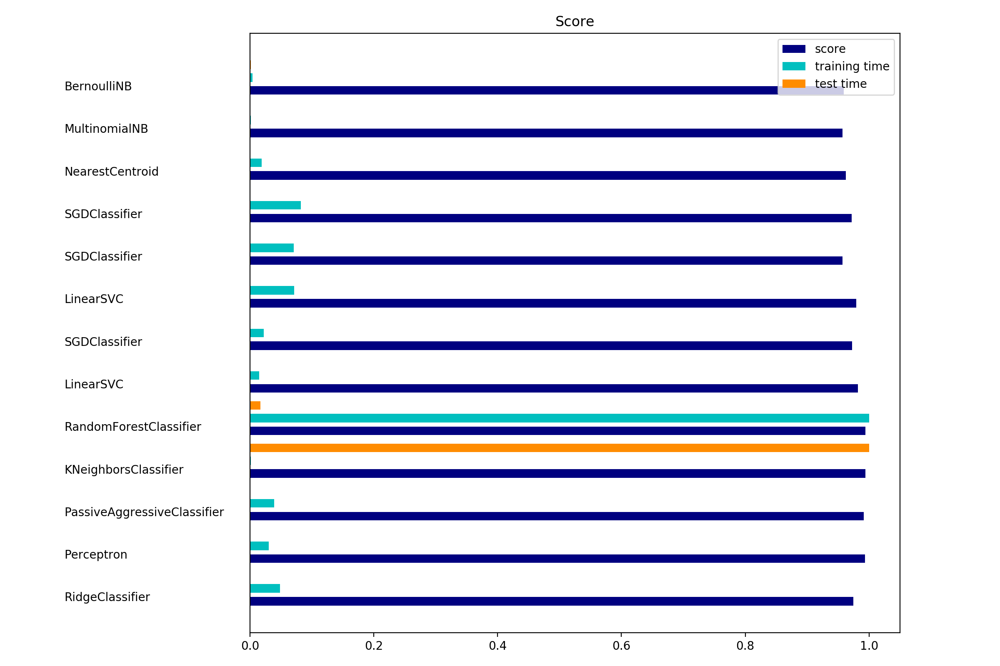

# Text classification using semantic annotation

## Report
[text classification using semantic annotation](./txt_classification_uris.pdf)

## Compatibility
* Python 2.7 / Python 3.4
* Linux / OSX / Windows

## Data
[Data](https://drive.google.com/open?id=11DQoZRFh4dmipyCz0bY5fT1Pnk7w3QSz)

## Environment
The code is runned in a 2.5 GHz Intel Core i7 with MacOS systems.

## Usage
### pre-process data
By [arff2txts.py](https://github.com/ShuangXieIrene/CSI5180Topics_in_Artifical_Intelligence/blob/master/assign_2/source_code/arff2txts.py): convert arff format file that contains examples from AI and Not-AI (Biology) into two groups of documents. One group has 2383
documents belonged to AI category and the other group has 1747 documents belonged to Biology category.

By [uris.py](https://github.com/ShuangXieIrene/CSI5180Topics_in_Artifical_Intelligence/blob/master/assign_2/source_code/uris.py): extract URIs from documents. Using [DBpedia Spotlight](http://www.dbpedia-spotlight.org/)

### Training
By [classifier_10fold.py](https://github.com/ShuangXieIrene/CSI5180Topics_in_Artifical_Intelligence/blob/master/assign_2/source_code/classifier_10fold.py).

## Model
[Classifier Models](https://drive.google.com/open?id=1hwrvkP4JcwVktqXB6hA-nJ4FkqJgWW4f)
the evaluation metrics are saved in 'log.txt' file and the classifier models after training are in pkl format.

## Results
 
